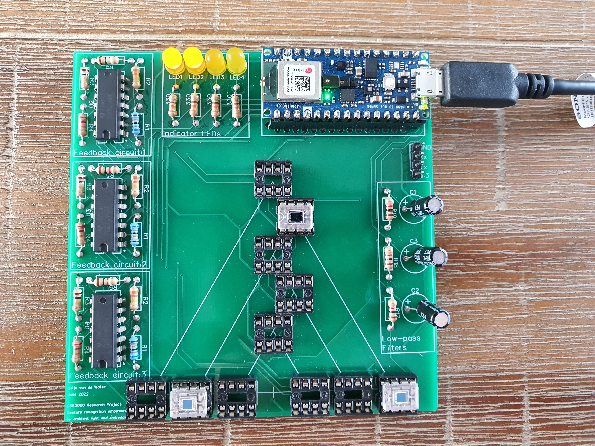

# CSE3000-Gesture-Recognition - Stijn

## Description
Gesture Recognition Empowered by Ambient Light and Embedded AI

This project is part of the CSE300 Research Project for the BSc Computer Science and Engineering at the Delft University of Technology. My task was to research both the impact of light intensity and the impact photodiode placement. The final paper, highlighting all results and design decision, can be found [here](https://repository.tudelft.nl/islandora/object/uuid:d41f29df-8958-433a-8e83-defc292bb27f?collection=education).

The PCB shown in the image is a custom PCB designed for this project. The circuit diagram and PCB design schematics can be found [here](https://oshwlab.com/stijnw66/research-project)

## File Structure (of relevant files)
- [src/main.cpp](./src/main.cpp) is the main code running on the arduino nano 33 BLE.

- [src/diode_calibration/diode_calibration.h](./src/diode_calibration/diode_calibration.h) is a header only library created for automatic sensitivity adjustment of the OPT101 photodiodes based on the ambient light intensity.

- [src/DTW/time_warping.py](./src/DTW/time_warping.py) is a python script calculating and storing the scores for each photodiode configuration.

- [src/data_collection/](./src/data_collection/) contains python scripts responsible for [collecting](./src/data_collection/main.py), [preprocessing](./src/data_collection/formatting_data.py), and [displaying data](./src/data_collection/display_pickled_files.py). All data is stored in the [data](./src/data_collection/data/) folder.

